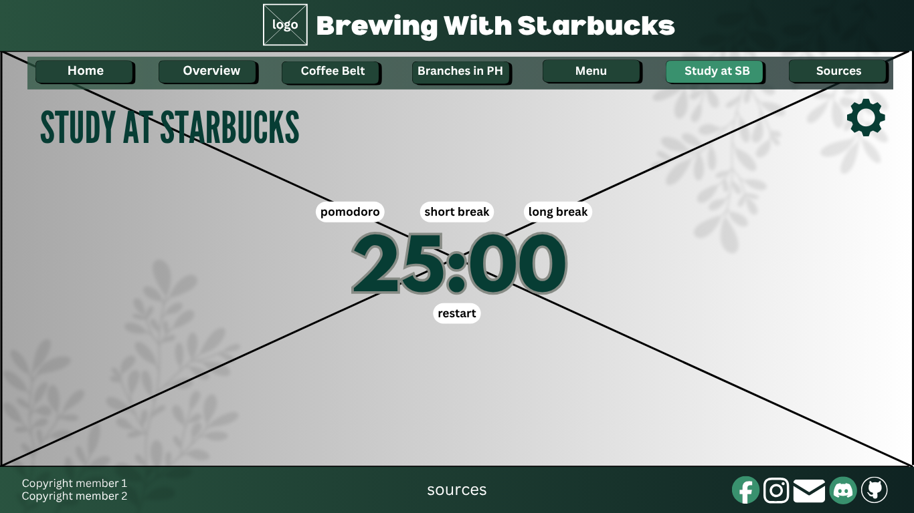
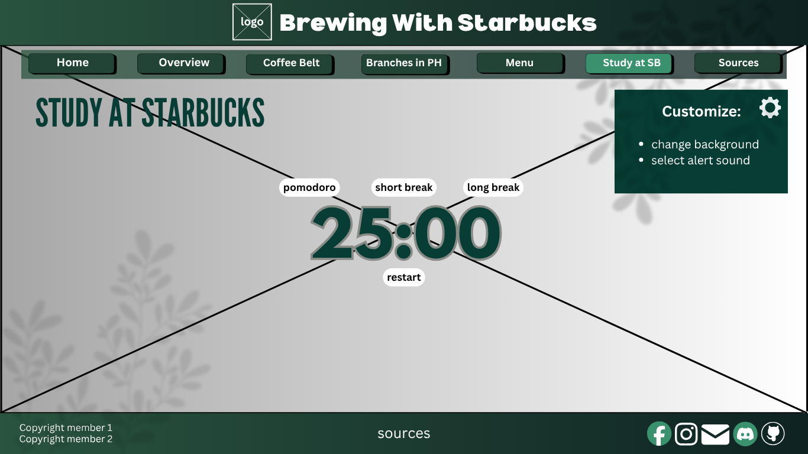

# Brewing with Starbucks 
## Where You Can Learn, Brew, and Study the Starbucks Way
*****
#### Logo: 
#### 

### Description: 

#### Starbucks is known for its high-quality coffee and its warm and inviting atmosphere. Each drink is brewed with attention and precision, down to the very care they put when harvesting their authentic coffee beans from their Coffee Belt around the world. The establishments itself are meant to serve as a ‘third-place’ atmosphere for customers, an inviting and accessible place where they can relax, socialize, work, and feel comfortable with a drink to accompany them. This website is meant to encapsulate that atmosphere, giving users an overview as to how Starbucks came to be, their process of collecting their authentic coffee beans, different branches of SB in the Philippines, and their menu. This website also allows for an immersive experience where users can study or relax through a digital Starbucks.  

#### We chose to make this the main focus of our website not only because of the variations of topics we can cover, but also because of our own personal experiences with Starbucks. As avid coffee lovers, their coffees offer a wide range of choices that makes it so that we are not limited to just a few flavors of coffee. They also offer other varieties of drinks such as refreshers for those who do not drink coffee or those who wish to drink something else. Starbucks is also our go-to hangout place, whether it is for hanging out with friends or a comfortable atmosphere to work on requirements. With these personal experiences, we wish to connect with other coffee lovers and help people find a place of comfort– like how Starbucks is a place of comfort for us. 

*****
### Webpage Breakdown: 

#### P1(Overview): This page will contain information regarding the origins of Starbucks. This includes the founders of Starbucks, the first Starbucks ever established in the world, the first Starbucks established in the Philippines, and other relevant information regarding their origins. 

#### P2(Coffee Belt): This page will contain information regarding the process of how Starbucks collects their coffee beans. It includes the Coffee Belt– different countries around the world where they buy their authentic coffee beans from.

#### P3(Branches in PH): This page will contain the different Starbucks branches in the Philippines, including both popular Starbucks locations in the country as well as those that are near/prevalent in Quezon City.

#### P4(Menu): This page will contain recommended menu items from Starbucks depending on certain preferences the user has. There will be buttons on the very top of the webpage, each one being different coffee/drink preferences that when clicked, will make the webpage scroll to that specific portion (drinks that match that preference).

#### P5(Study at SB): This page will contain an immersive experience for the user, with a background image and background audio that will make it feel like the user is actually at Starbucks. The background images can be changed based on the user’s preference, with a sidebar showing different background options that the user can choose from. 

#### P6(Sources): This page will contain the information regarding the creators of the website (Abigail Lorenzana and Bernice Lorenzo of B2029 Lithium) as well as the list of sources used for the project.

*****
### Implementation of JavaScript: 

#### We will implement JavaScript into our website via the use of JS in Webpage 5 (Study at SB). JavaScript will be used in order to code the timer that will serve as our Pomodoro clock as well as the timer for both short and long break. We will also use JavaScript to allow the user to change the background image and alarm audio of Webpage 5 based on the image/alarm that they click.

*****

### Wireframes: 

### Home Page:
#### 

### Overview (P1):
#### 

### Coffee Belt (P2):
#### 

### Branches in PH (P3):
<<<<<<< HEAD
#### 
=======
#### )
>>>>>>> 3a812398f8727156107961575349b05cb1f3790c

### Menu (P4):
#### 

### Study at SB (P5):
#### 

### Study at SB - Expanded (P5):
#### 

### Sources (P6):
#### 

